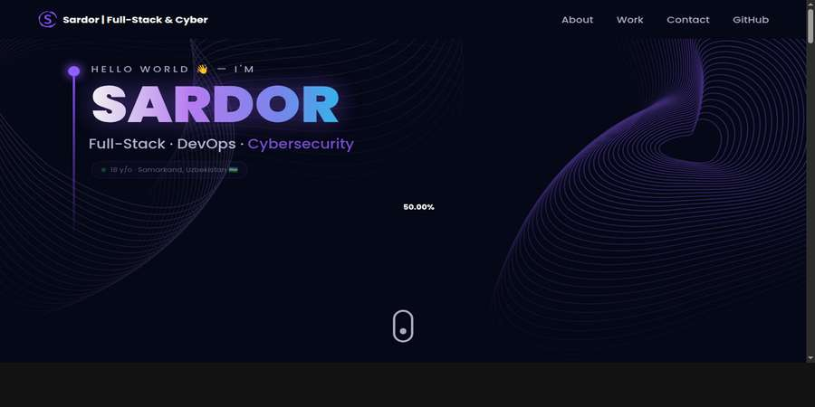

<a name="readme-top"></a>

<div align="center">

# 🚀 Sardor — 3D Portfolio

### Full-Stack · DevOps · Cybersecurity


[](https://builtbysardor.github.io/Portfolio/)
[](https://github.com/builtbysardor)
[](https://reactjs.org)
[](https://threejs.org)
[](https://typescriptlang.org)
[](https://vitejs.dev)

</div>

---

## 👋 About

Hi, I'm **Sardor** — an 18-year-old self-taught developer from **Samarkand, Uzbekistan 🇺🇿**.

I build **production-grade full-stack web applications**, **DevOps infrastructure tooling**, and **real-time cybersecurity systems**. This is my personal 3D portfolio built with React, Three.js and TypeScript — featuring an interactive 3D computer model, animated sections, and a contact form.

---

## 📸 Screenshots

### 🏠 Hero — 3D Computer Model


### 🧑‍💻 About & Services


### 🗂️ Projects


---

## ✨ Features

- 🖥️ **Interactive 3D computer model** powered by Three.js & React Three Fiber
- 🌌 **Animated starfield background** with particle effects
- 📜 **Vertical timeline** — work experience with smooth scroll animations
- 🎯 **Tilt effect cards** — projects & services with hover 3D tilt
- ⌨️ **Framer Motion** animations throughout every section
- 📡 **EmailJS** contact form — sends emails directly from the browser
- 🌐 **3D Earth model** on the contact section
- ⚡ **Vite** — blazing fast build & HMR
- 📱 **Fully responsive** — mobile, tablet, desktop

---

## 🗂️ Projects Featured

| # | Project | Stack | Description |
|---|---------|-------|-------------|
| 1 | **Nexus Pro** | Next.js · WebSockets · TypeScript | Real-time infrastructure monitoring dashboard |
| 2 | **SentinelLog v2** | FastAPI · Python · WebSockets | SOC dashboard — detects SSH brute-force, SQLi, DDoS |
| 3 | **InfraWatch** | Prometheus · Grafana · Docker | One-command full observability monitoring stack |
| 4 | **PhishGuard AI** | Python · FastAPI · Naive Bayes ML | 100% local phishing email detector |
| 5 | **Antivirus Pro** | Python · VirusTotal API · Radar | Enterprise cybersecurity dashboard |
| 6 | **KriptoVault** | Python · FastAPI · Crypto | Secure offline cipher & encryption vault |

---

## 🛠️ Tech Stack

| Category | Technologies |
|----------|-------------|
| **Frontend** | React 18, TypeScript, Tailwind CSS |
| **3D / Animation** | Three.js, React Three Fiber, Drei, Framer Motion |
| **Build** | Vite, PostCSS |
| **Email** | EmailJS |
| **Deployment** | GitHub Pages |

---

## 📁 Folder Structure

```
Portfolio/
├── public/
│   └── desktop_pc/          # 3D computer GLTF model
├── src/
│   ├── assets/              # Images, icons, tech logos
│   ├── components/
│   │   ├── canvas/          # Three.js 3D components
│   │   │   ├── computers.tsx   # 3D desktop computer
│   │   │   ├── earth.tsx       # 3D earth (contact section)
│   │   │   ├── stars.tsx       # Animated starfield
│   │   │   └── ball.tsx        # 3D tech icon balls
│   │   ├── hero.tsx
│   │   ├── about.tsx
│   │   ├── experience.tsx
│   │   ├── tech.tsx
│   │   ├── works.tsx
│   │   ├── contact.tsx
│   │   └── navbar.tsx
│   ├── constants/
│   │   └── index.ts         # ← All portfolio data lives here
│   ├── hoc/
│   │   └── section-wrapper.tsx
│   ├── utils/
│   │   └── motion.ts
│   ├── styles.ts
│   └── app.tsx
├── index.html
├── tailwind.config.ts
└── vite.config.ts
```

---

## 🚀 Getting Started

### Prerequisites
- Node.js 18+
- npm or bun

### Installation

```bash
# Clone the repo
git clone https://github.com/builtbysardor/Portfolio.git
cd Portfolio

# Install dependencies
npm install --legacy-peer-deps

# Start dev server
npm run dev
# → http://localhost:5173
```

### Build for production

```bash
npm run build
npm run preview
```

---

## ⚙️ Customization

All portfolio content is in one file — **`src/constants/index.ts`**:

```ts
// Change your info here:
export const SERVICES = [ ... ]     // Service cards
export const EXPERIENCES = [ ... ]  // Work timeline
export const PROJECTS = [ ... ]     // Project cards
export const SOCIALS = [ ... ]      // Social links
```

And update the **hero** name/bio in `src/components/hero.tsx`.

---

## 📬 EmailJS Setup

1. Go to [emailjs.com](https://emailjs.com) and create a free account
2. Create an **Email Service** and **Email Template**
3. Copy your `SERVICE_ID`, `TEMPLATE_ID`, `PUBLIC_KEY`
4. Add them to `src/components/contact.tsx`

---

## 📦 Deploy

### GitHub Pages (avtomatik)

Har safar `main` ga push qilinganda `.github/workflows/deploy.yml` orqali avtomatik deploy bo'ladi.

```bash
git push origin main
# → https://builtbysardor.github.io/Portfolio/
```

---

## 🔗 Connect

<div align="center">

[](https://github.com/builtbysardor)
[](mailto:aturdiyev787@gmail.com)

</div>

---

<div align="center">

Built with ❤️ by **Sardor** · Samarkand, Uzbekistan 🇺🇿

⭐ Star this repo if you like it!

</div>
